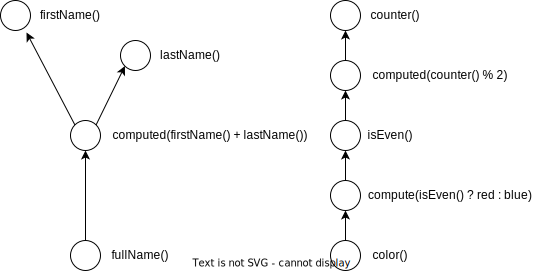
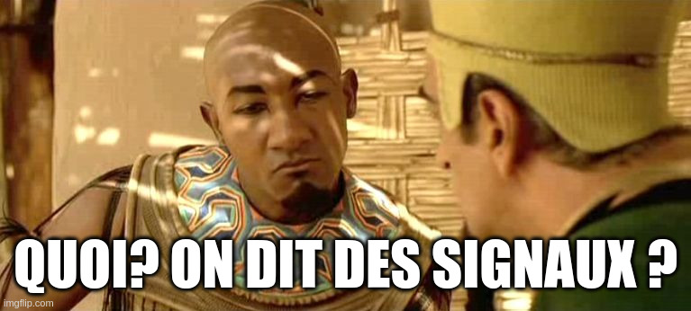

# Angular signals: how do they work ??? 


---
- Bonjour, dans ce talk je vais vous parler des signals, une nouvelle api d'angular pour faire de la réactivité
- Comment ca va nous changer la vie en tant que devs angular
- Et surtout qu'est ce que ca veut dire pour le futur du framework


<p class="half-size">
"Fucking magnets, how do they work?"<br/>
<i>Insane Clown Possee - Miracles</i></p>

---
- j'ai la référence
- Si vous connaissez ce même, vous êtes sur internet depuis trop longtemps.


## Introduction

- Benjamin Legrand
- 🐦 @benjilegnard<!-- .element: class="fragment" -->
- 🏢 onepoint<!-- .element: class="fragment" -->
- 🧙‍♂️ 15 ans d'XP<!-- .element: class="fragment" -->
- 🅰️️ Angular enjoyer<!-- .element: class="fragment" -->
- 🎸 musique / ⌨️ claviers<!-- .element: class="fragment" -->


### La réactivité

- 🤷‍ le fait de réagir
- "Reactive Programming is a declarative programming paradigm built on data-centric event emitters." (Ryan Carniato)<!-- .element: class="fragment" -->


---
- on réagit à un changement de données, a un évènement.
- modèle de programmation déclarative basée sur des émetteurs d'évenements, et centrée sur les données et leur changement.
- ryan carniato : papa de solid
- le concept existe depuis aussi longtemps que l'informatique
- par example excel, vous mettez une formule de calcul dans une cellule
- mention de knockout.js


### Comment ?

- Value-based
- Observable-based<!-- .element: class="fragment" -->
- Signal-based<!-- .element: class="fragment" -->

---
- Value-based; that is, dirty-checking: (Angular, React, Svelte)
- Observable-based: (Angular with RxJS, Svelte)
- Signal-based: (Angular with signals, Qwik, React with MobX, Solid, Vue)


## Le passé


---
- comment on faisait avant ?


### à l'ancienne, impératif

- je recois une donnée<!-- .element: class="fragment" -->
- mise à jour manuelle partout où on l'affiche<!-- .element: class="fragment" -->
- Vanilla js / jQuery<!-- .element: class="fragment" -->

---
- jQuery ou Vanilla, pareil, pas de réactivité dans le language de base
dirty-checking
- single source of truth
- 2e problème asynchrone


### The only constant is change

- Promise&lt;Value&gt; 🤝
- asynchrone contaminant<!-- .element: class="fragment" -->
- async / await<!-- .element: class="fragment" -->
---
- Quand on parle de réactivité, on peut gérer de l'asynchrone
- Soit la valeur existe soit elle n'existe pas encore.
- En angular (v2++) les solutions pour ca sont basées sur: rxjs, et zone.js


### rxjs

- Observable&lt;Value&gt; 🔍
- yes, but...<!-- .element: class="fragment" -->
---
- angular est fondamentalement basé sur les observables
- un observable encapsule une valeur qui change au fil du temps
- j'adore RxJS, c'est super puissant pour exprimer déclarativement des changements au fil du temps, mais: c'est complexe


#### creation operators

- ajax
- bindCallback
- bindNodeCallback
- defer
- empty
- from
- fromEvent
- fromEventPattern
- generate
- interval
- of
- range
- throwError
- timer
- iif
- combineLatest
- concat
- forkJoin
- merge
- partition
- race
- zip

<!-- .element: class="stamps" -->

---
- Ici on a les opérateurs à connaitre quand on veut créer des observables


#### Transformation operators

- buffer
- bufferCount
- bufferTime
- bufferToggle
- bufferWhen
- concatMap
- concatMapTo
- exhaust
- exhaustMap
- expand
- groupBy
- map
- mapTo
- mergeMap
- mergeMapTo
- mergeScan
- pairwise
- partition
- pluck
- scan
- switchScan
- switchMap
- switchMapTo
- window
- windowCount
- windowTime
- windowToggle
- windowWhen

<!-- .element: class="stamps" -->

---
- Ici quand on veut les manipuler ou les transformer


#### Filtering Operators

- audit
- auditTime
- debounce
- debounceTime
- distinct
- distinctUntilChanged
- distinctUntilKeyChanged
- elementAt
- filter
- first
- ignoreElements
- last
- sample
- sampleTime
- single
- skip
- skipLast
- skipUntil
- skipWhile
- take
- takeLast
- takeUntil
- takeWhile
- throttle
- throttleTime

<!-- .element: class="stamps" -->

---
- Si on veut filtrer ou transformer les valeurs c'est encore un autre délire


### yes, but...

- API... <span class="fragment">foisonnante</span>
- marche d'entrée HAUTE<!-- .element: class="fragment" -->
- unsubscribe / fuites mémoires<!-- .element: class="fragment" -->
---
- gestion de l'unsubscribe() pas simple
- modéle mental du cycle de vie d'un observable à avoir
-  source de fuites mémoires.


### Zone.js

- monkey-patch votre code 🙈
- asynchrone / microtasks<!-- .element: class="fragment" -->
- détection de changement<!-- .element: class="fragment" -->
---
- problématiques de performance
- intégration de librairie tierces problématiques ( runOutsideAngular )


### détection de changement angular

- basée sur l'arbre de composants
- top - down<!-- .element: class="fragment" -->
- pas "granulaire"<!-- .element: class="fragment" -->
---
- ici on compare cycle de vie aussi versus réactivité
- c'est pas "granulaire" = on re-rends tout un composant au lieu de juste ce qui a changé
- rien que le reparcours de l'arbre peut piquer


### producer and consumer

Producer ⮀ Consumer<br/>
    📣 ⮀ 👂
---
- on va avoir le concept dans les observables comme les promesses
- ( comme dans plein d'implémentations réactive )
- de qui consomme la donnée et qui la produit
- dans quel sens ? ( push vs pull )


### Push vs pull table

|      | Single   | Multiple   |
| ---- | -------- | ---------- |
| Pull | Function | Iterator   |
| Push | Promise  | Observable |
---
- impératif : pull on demande la donnée
- abonnement, la données nous est fournie via un callback
- Ou sont les signals là dedans (au milieu)


### Push vs pull table

|      | Single   | Multiple   |
| ---- | -------- | ---------- |
| Pull | Function | Iterator   |
|      |          | ➡️ Signal ⬅️ |
| Push | Promise  | Observable |


## Le présent


---
- nouvelle primitive de base dans angular Signals API
- qu'est ce que ca veut dire


### Who's got signals already ?

- Solid
- Preact
- MobX
- Qwik
- Svelte
- Knockout
- Ember
- Pikachu
---
- les bonnes idées sont contagieuses
- le concept existe déjà dans d'autre frameworks
- y'en a un la dedans c'est un pokemon


### Who's got signals already ?

- Solid
- Preact
- MobX
- Qwik
- Svelte
- Knockout
- Ember
- 🎉 Angular 🎉
---
- on va adopter un concept qui existe déjà ailleurs
- comment on réconcilie tout ca ?


### RFC: Request For Comments

- Avril 2023
- [RFC: Angular Signals🚦](https://github.com/angular/angular/discussions/49685)
- découpée en 4 :
  - #1 : [Signals for Angular Reactivity](https://github.com/angular/angular/discussions/49684)
  - #2 : [Signals API](https://github.com/angular/angular/discussions/49683)
  - #3 : [Signal-based components](https://github.com/angular/angular/discussions/49682)
  - #4 : [Observable and signal interactivity](https://github.com/angular/angular/discussions/49681)
---
- Request For Comments = discussion / demande de l'avis des devs
- pas stable, pas une roadmap, une RFC peut être annulée ou modifiée
- Néanmoins pas mal de directions pour le futur d'angular avec les signals sont là


### Signal, l'API :

```typescript [|2]
interface Signal<T> {
  (): T;
  [SIGNAL]: unknown;
}
```
---
- Un signal encapsule une valeur
- c'est du js donc à la fois une fonction et un objet
- le symbol SIGNAL est là pour permettre à angular de savoir qu'on manipule un signal


### signal(), usage

```typescript [|1|3]
const counter: Signal<number> = signal(0);

console.log(counter()); // 0
```
---
- factory method pour creer un signal
- c'est synchrone


### un signal c'est un getter

- fin du talk, merci


### WritableSignal

```typescript [|2|3|4]
interface WritableSignal<T> extends Signal<T> = {
  (): T;
  set(value: T): void;
  update(updateFn: (value: T) => T): void;
  asReadonly(): Signal<T>;
}
```
---
- set va changer les valeurs, changer complètement, replace l'ancienne
- update va vous permettre de passer une méthode de mise à jour a partir de l'ancienne valeur ( redux reducer, immutable )
- asReadOnly donne une version lecture seule du signal


### WritableSignal, usage

```typescript [|2|5|8]
// create a writable signal
const counter = signal(0);

// set a new signal value, completely replacing the current one
counter.set(5);

// update signal's value based on the current one
counter.update(currentValue => currentValue + 1);
```
---
- à noter: tout est synchrone
- il existait aussi mutation, mais supprimé
- immutabilité ftw


### computed()

```typescript [|1|4|7]
const counter = signal(0);

// creating a computed signal
const isEven = computed(() => counter() % 2 === 0);

// computed properties are signals themselves
const color = computed(() => isEven() ? 'red' : 'blue');
```
---
- souvent on veut des valeurs dérivées d'autres
- computed est là pour ca


### effect()
```typescript [|1-2|5]
const firstName = signal('John');
const lastName  = signal('Doe');

// This effect logs the first and last names, and will log them again when either (or both) changes. 
effect(() => console.log(firstName(), lastName()));
```
---
Cas d'utilisation:
- synchronizing data between multiple independent models
- triggering network requests
- performing rendering actions


### Creusons un peu 

```typescript [|2|6-9|10|7]
export function signal<T>(initialValue: T, options?: CreateSignalOptions<T>): WritableSignal<T> {
  const node: SignalNode<T> = Object.create(SIGNAL_NODE);
  node.value = initialValue;
  options?.equal && (node.equal = options.equal);

  function signalFn() {
    producerAccessed(node);
    return node.value;
  }
  return signalFn as WritableSignal<T>;
}
```
---
- core/primitive : https://github.com/angular/angular/tree/main/packages/core/primitives/signals
- à noter : le signalFn() dans une fonction interne, permets aux fonctions de garder une référence du this
- producerAccessed vient du module "graph" >>


### Creusons encore



---
- ReactiveNode: peut être producer ou consumer, ou les deux
- notion de dirty sur un noeud
- chaque fois qu'un signal est crée un producer est crée, quand un signal est appelé, un noeud consumer est crée / actualisé
- je vais pas plus loin, allez lire le code source de vos frameworks, c'est instructif


### Avantages


- it is just a function
- and sometimes the best solution is a function<!-- .element: class="fragment" -->
- not a class, not a decorator. just a function<!-- .element: class="fragment" -->
---
- Simplicité
- courbe d'apprentissage réduite
- synchrone


## LE FUTUR


### signal-based component
```typescript [|9|12|4-5]
@Component({
  selector: 'temperature-calc',
  template: `
    <p>C: {{ celsius() }}</p>
    <p>F: {{ fahrenheit() }}</p>
  `,
})
export class SimpleCounter {
  celsius = signal(25);

  // The computed only re-evaluates if celsius() changes.
  fahrenheit = computed(() => this.celsius() * 1.8 + 32);
}
```


### oui mais....
- "on m'a toujours dit de ne jamais appeler de fonctions dans les templates"
---
- sinon ca se ré-exécute à chaque détection de changement
- ca ne s'applique plus dans un composant marqué signal
- les expressions ne se réevalue que quand le signal a changé 


### inputs

```typescript [|4-5|10,13|15-16]
@Component({
  selector: 'user-profile',
  template: `
    <p>Name: {{ firstName() }} {{ lastName() }}</p>
    <p>Account suspended: {{ suspended() }}</p>
  `,
})
export class UserProfile {
  // Create an optional input without an initial value.
  firstName = input<string>(); // Signal<string|undefined>

  // Create an input with a default value
  lastName = input('Smith'); // Signal<string>

}
```


### outputs

```typescript [|4-5|9-10|11-16]
@Component({
  selector: 'simple-counter',
  template: `
    <button (click)="save()">Save count</button>
    <button (click)="reset()">Reset count</button>
  `,
})
export class SimpleCounter {
  saved = output<number>(); // EventEmitter<number>
  cleared = output<number>({alias: 'reset'});
  save() {
    this.saved.emit(123);
  }
  reset() {
    this.cleared.emit(456);
  }
}
```


### so long

- ~~@Input()~~
- ~~@Output()~~
- 🫡<!-- .element: class="fragment" -->


```typescript [|4|6|11-12|15]
@Component({
  selector: 'form-field',
  template: `
    <field-icon *ngFor="let icon of icons()"> {{ icon }} </field-icon>
    <div class="focus-outline">
      <input #field>
    </div>
  `
})
export class FormField {
  icons = viewChildren(FieldIcon); // Signal<FieldIcon[]>
  input = viewChild<ElementRef>('field'); // Signal<ElementRef>

  someEventHandler() {
    this.input().nativeElement.focus();
  }
}
```


### goodbye decorators

- ~~@ViewChild()~~
- ~~@ContentChild()~~
- ~~@ViewChildren()~~
- ~~@ContentChildren()~~
- 🫡<!-- .element: class="fragment" -->


### Application Lifecycle

- `afterRender()`
- `afterNextRender()`
---
- nouvelles fonctions apparues en v16 pour se rattacher au rendu du composant
- afterNextRender(): Once after the next change detection cycle.
- afterRender(): Après chaque cycle de vie


### simplify

- ngOnInit()
- ngOnDestroy()
---
- le cycle de vie d'un composant signal-based se résume à ca


### not anymore
- ~~ngOnChanges()~~
- ~~ngDoCheck()~~
- ~~ngAfterViewInit()~~
- ~~ngAfterContentInit()~~
- ~~ngAfterViewChecked()~~
- ~~ngAfterContentChecked()~~
- 🫡<!-- .element: class="fragment" -->


## Le futur (2)


Your kids are gonna love it


### Statut actuel

- `signal()`, `computed()` et `effect()`
- __developer preview__ en v16
- __stable__ en v17 <!-- .element: class="fragment" -->

<!-- .element: class="fragment" -->

- tout le reste n'existe pas (encore)
- signal-based components en __developer preview__ en v17 ?

<!-- .element: class="fragment" -->
---
- vous pouvez déjà jouer avec
- developer preview: ON NE VA PAS EN PROD AVEC
- rendu / signal-based pas encore là


### où et quand utiliser signals vs rxjs ?

- why not both ?<!-- .element: class="fragment" -->
- component <-> template<!-- .element: class="fragment" -->
- état simple<!-- .element: class="fragment" -->
---
- Pour l'instant tant que tout l'ècosystême n'a pas suivi, c'est le seul intérêt
- Permets une réactivité plus fine
- Évite d'utiliser des subjects, des Observable et des choses asynchrone pour ce qui devrait être synchrone


### interopérabilité 

- toSignal(o: Observable): Signal<!-- .element: class="fragment" -->
- toObservable(s: Signal): Observable<!-- .element: class="fragment" -->
---
- on va pouvoir migrer tranquillement de l'un à l'autre
- signal ne remplacera jamais observable


### inconvénients / craintes

- plusieurs manières de faire la même chose<!-- .element: class="fragment" -->
- schisme de l'écosystème<!-- .element: class="fragment" -->
- pas de compatibilité entre libs<!-- .element: class="fragment" -->
---
- //TODO résumer la RFC Summary
- pas dans le language


### avantages / le futur d'angular

- plus simple<!-- .element: class="fragment" -->
- support LTS<!-- .element: class="fragment" -->
- flux de contrôle ( @if, @for, @switch )<!-- .element: class="fragment" -->
- ⚠️ ne remplace pas rxjs<!-- .element: class="fragment" -->
---
- Ce n'est pas la mort d'rxjs


### Zoneless applications
- applications sans Zone.js
- ⚠️ ne veut pas dire que Zone.js est abandonné<!-- .element: class="fragment" -->
---
- An application would have to fully track its model in signals to completely remove dependency on zone.js.
- bien pour les nouvelles applis
- ne migrez pas sans zone.js sans réfléchir, vous allez avoir des problèmes


### roadmap et librairies à cotê

- RFC coté librairies de gestion d'état :
  - [NgRx SignalStore](https://github.com/ngrx/platform/discussions/3796]) 
  - [rx-angular](https://github.com/rx-angular/rx-angular/pull/1523)
  - [NGXS](https://github.com/ngxs/store/discussions/1977)
---
- toutes les libs de gestion d'état angular
  - on compris l'intêret
  - ont une RFC pour l'adopter


## Conclusion



---
- J'en ai terminé
- boule de cristal sur l'avenir angular
- Merci de m'avoir écouté.


### Sources

- [la RFC de base](https://github.com/angular/angular/discussions/49685)
- [AMA sur reddit sur le sujet](https://www.reddit.com/r/Angular2/comments/12t7107/informal_ama_angular_signals_rfc/)
- [Article sur AngularExperts à propos du push/pull](https://angularexperts.io/blog/angular-signals-push-pull)
- [The evolution of signals in javascript](https://dev.to/this-is-learning/the-evolution-of-signals-in-javascript-8ob)
- [useSignal is the future of web frameworks](https://www.builder.io/blog/usesignal-is-the-future-of-web-frameworks)
- [Signals in typescript, the Road to Solid v1.7](https://www.youtube.com/watch?v=2fW6JaJHoCE)
- [Signals, what is going on behind the scene](https://itnext.io/signals-whats-going-on-behind-the-scenes-ec858589ea63)


### Merci

<div class="qr-codes">
  <div class="slides-link">
    <h4>⬇️ Slides ⬇️</h4>
    <a href="https://b-legrand.github.io/angular-signals-how-do-they-work/">
      
    </a>
  </div>
  
  <div class="openfeedback-link">
    <h4>⬇️ Feedback ⬇️</h4>
    <a href="https://openfeedback.io/sunnytech2024/2024-07-04/les-signals-avec-angular-comme">
      
    </a>
  </div>
</div>
