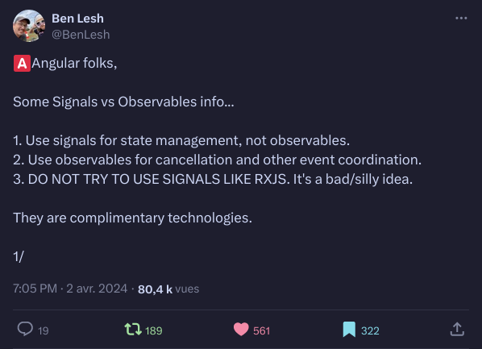
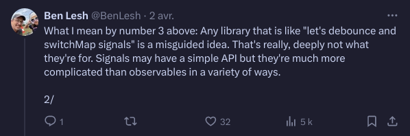
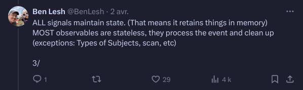
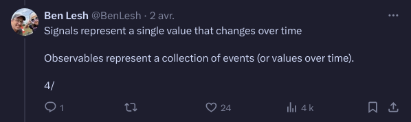
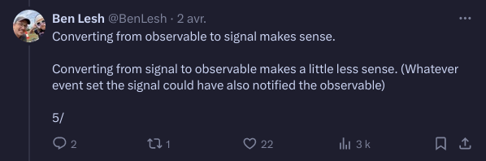
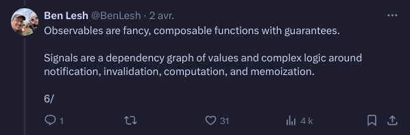
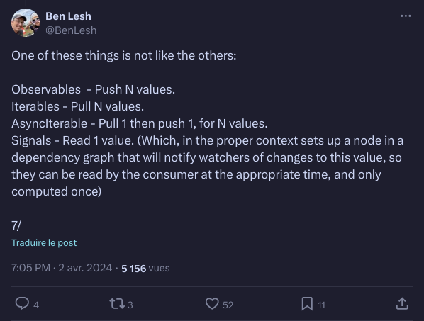
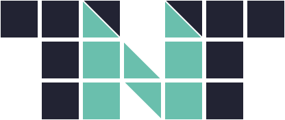

# Angular signals: how do they work ??? 


---
- Bonjour, dans ce talk je vais vous parler des signals, une nouvelle api d'angular pour faire de la réactivité
- Comment ca va nous changer la vie en tant que devs angular
- Et surtout qu'est ce que ca veut dire pour le futur du framework


<p class="half-size">
"Fucking magnets, how do they work?"<br/>
<i>Insane Clown Possee - Miracles</i></p>

---
- j'ai la référence
- Si vous connaissez ce même, vous êtes sur internet depuis trop longtemps.


## Introduction

- Benjamin Legrand
- 🐦 @benjilegnard<!-- .element: class="fragment" -->
- 🏢 onepoint<!-- .element: class="fragment" -->
- 🧙‍♂️ 15 ans d'XP<!-- .element: class="fragment" -->
- 🅰️️ Angular enjoyer<!-- .element: class="fragment" -->
- 🎸 musique / ⌨️ claviers<!-- .element: class="fragment" -->
---
15 ans, bientôt 18


### La réactivité

- 🤷‍ le fait de réagir
- "Reactive Programming is a declarative programming paradigm built on data-centric event emitters." (Ryan Carniato)<!-- .element: class="fragment" -->
---
- ryan carniato : papa de solid
- on réagit à un changement de données, a un évènement.
- centré sur les données et leur changement.
- existe depuis aussi longtemps que l'informatique


---
- le concept existe depuis aussi longtemps que l'informatique
- par example excel, vous mettez une formule de calcul dans une cellule
- autre example, facebook et ses messages counters.


### Comment ?

- Value-based<!-- .element: class="fragment" -->
- Observable-based<!-- .element: class="fragment" -->
- Signal-based<!-- .element: class="fragment" -->

---
- Value-based; that is, dirty-checking: (Angular, React, Svelte)
- Observable-based: (Angular with RxJS, Svelte)
- Signal-based: (Angular with signals, Qwik, React with MobX, Solid, Vue)


## Le passé


---
- comment on faisait avant ?


### à l'ancienne, impératif

- je recois une donnée<!-- .element: class="fragment" -->
- mise à jour manuelle partout où on l'affiche<!-- .element: class="fragment" -->
- Vanilla js / jQuery<!-- .element: class="fragment" -->

---
- jQuery ou Vanilla, pareil, pas de réactivité dans le language de base
dirty-checking
- single source of truth
- 2e problème asynchrone


### The only constant is change

- Promise&lt;Value&gt; 🤝
- asynchrone contaminant<!-- .element: class="fragment" -->
- async / await<!-- .element: class="fragment" -->
---
- Quand on parle de réactivité, on peut gérer de l'asynchrone
- Soit la valeur existe soit elle n'existe pas encore.
- En angular (v2++) les solutions pour ca sont basées sur: rxjs, et zone.js


### rxjs

- Observable&lt;Value&gt; 🔍
- yes, but...<!-- .element: class="fragment" -->
---
- angular est fondamentalement basé sur les observables
- un observable encapsule une valeur qui change au fil du temps
- j'adore RxJS, c'est super puissant pour exprimer déclarativement des changements au fil du temps, mais: c'est complexe


#### creation operators

- ajax
- bindCallback
- bindNodeCallback
- defer
- empty
- from
- fromEvent
- fromEventPattern
- generate
- interval
- of
- range
- throwError
- timer
- iif
- combineLatest
- concat
- forkJoin
- merge
- partition
- race
- zip

<!-- .element: class="stamps" -->

---
- Ici on a les opérateurs à connaitre quand on veut créer des observables


#### Transformation operators

- buffer
- bufferCount
- bufferTime
- bufferToggle
- bufferWhen
- concatMap
- concatMapTo
- exhaust
- exhaustMap
- expand
- groupBy
- map
- mapTo
- mergeMap
- mergeMapTo
- mergeScan
- pairwise
- partition
- pluck
- scan
- switchScan
- switchMap
- switchMapTo
- window
- windowCount
- windowTime
- windowToggle
- windowWhen

<!-- .element: class="stamps" -->

---
- Ici quand on veut les manipuler ou les transformer


#### Filtering Operators

- audit
- auditTime
- debounce
- debounceTime
- distinct
- distinctUntilChanged
- distinctUntilKeyChanged
- elementAt
- filter
- first
- ignoreElements
- last
- sample
- sampleTime
- single
- skip
- skipLast
- skipUntil
- skipWhile
- take
- takeLast
- takeUntil
- takeWhile
- throttle
- throttleTime

<!-- .element: class="stamps" -->

---
- Si on veut filtrer ou transformer les valeurs c'est encore un autre délire


### yes, but...

- API... <span class="fragment">foisonnante</span>
- marche d'entrée HAUTE<!-- .element: class="fragment" -->
- unsubscribe / fuites mémoires<!-- .element: class="fragment" -->
<li><span class="color-red">red</span> / <span class="color-blue">blue</span> methods</li><!-- .element: class="fragment" -->
---
- gestion de l'unsubscribe() pas simple
- modéle mental du cycle de vie d'un observable à avoir
-  source de fuites mémoires.


### Zone.js

- monkey-patch votre code 🙈
- asynchrone / microtasks<!-- .element: class="fragment" -->
- détection de changement<!-- .element: class="fragment" -->
---
- déjà eu des soucis avec ou pas du tout
- se place entre votre code et vos callbacks/asynchrones
- Mais nécéssaire à la détection de changement "standard"


### Yes, but...

- Performance 🐌(runOutsideAngular)<!-- .element: class="fragment" -->
- 30kb de JS 🚚<!-- .element: class="fragment" -->
- Stacktraces 🕵️‍♂ <!-- .element: class="fragment" -->
- Pas d'async/await natif<!-- .element: class="fragment" -->
- Magique 🎩<!-- .element: class="fragment" -->
---
Inconvénients de zone.js
- contexte d'exécution trop "magique" pour les devs
- problématiques de performance
- intégration de librairie tierces problématiques ( runOutsideAngular )


### détection de changement angular

- basée sur l'arbre de composants
- top - down<!-- .element: class="fragment" -->
- pas "granulaire"<!-- .element: class="fragment" -->
---
- ici on compare cycle de vie aussi versus réactivité
- c'est pas "granulaire" = on re-rends tout un composant au lieu de juste ce qui a changé
- rien que le reparcours de l'arbre peut piquer


### producer and consumer

Producer ⮀ Consumer<br/>
    📣 ⮀ 👂
---
- on va avoir le concept dans les observables comme les promesses
- ( comme dans plein d'implémentations réactive )
- de qui consomme la donnée et qui la produit
- dans quel sens ? ( push vs pull )


### Push vs pull table

|      | Single   | Multiple   |
| ---- | -------- | ---------- |
| Pull | Function | Iterator   |
| Push | Promise  | Observable |
---
- impératif : pull on demande la donnée
- abonnement, la données nous est fournie via un callback
- Ou sont les signals là dedans (au milieu)


### Push vs pull table

|      | Single   | Multiple   |
| ---- | -------- | ---------- |
| Pull | Function | Iterator   |
|      |          | ➡️ Signal ⬅️ |
| Push | Promise  | Observable |


## Le présent


---
- nouvelle primitive de base dans angular Signals API
- qu'est ce que ca veut dire


### Who's got signals already ?

- Solid
- Preact
- MobX
- Qwik
- Svelte
- Knockout
- Ember
- Pikachu
---
- les bonnes idées sont contagieuses
- le concept existe déjà dans d'autre frameworks
- y'en a un la dedans c'est un pokemon


### Who's got signals already ?

- Solid
- Preact
- MobX
- Qwik
- Svelte
- Knockout
- Ember
- 🎉 Angular 🎉
---
- on va adopter un concept qui existe déjà ailleurs
- notez qu'il y a pas React dans cette liste
- comment on réconcilie tout ca ?


### RFC: Request For Comments

- Avril 2023
- [RFC: Angular Signals🚦](https://github.com/angular/angular/discussions/49685)
- découpée en 4 :
  - #1 : [Signals for Angular Reactivity](https://github.com/angular/angular/discussions/49684)
  - #2 : [Signals API](https://github.com/angular/angular/discussions/49683)
  - #3 : [Signal-based components](https://github.com/angular/angular/discussions/49682)
  - #4 : [Observable and signal interactivity](https://github.com/angular/angular/discussions/49681)
---
- Request For Comments = discussion / demande de l'avis des devs
- pas stable, pas une roadmap, une RFC peut être annulée ou modifiée
- Néanmoins pas mal de directions pour le futur d'angular avec les signals sont là


### Signal, l'API :

```typescript [|2|3]
interface Signal<T> {
  (): T;
  [SIGNAL]: unknown;
}
```
---
- Un signal encapsule une valeur
- c'est du js donc à la fois une fonction et un objet
- le symbol SIGNAL est là pour permettre à angular de savoir qu'on manipule un signal


### signal(), usage

```typescript [|1|3]
const counter: Signal<number> = signal(0);

console.log(counter()); // 0
```
---
- factory method pour creer un signal
- c'est synchrone


### un signal c'est un getter

- fin du talk, merci


### WritableSignal

```typescript [|2|3|4|5]
interface WritableSignal<T> extends Signal<T> = {
  (): T;
  set(value: T): void;
  update(updateFn: (value: T) => T): void;
  asReadonly(): Signal<T>;
}
```
---
- set va changer les valeurs, changer complètement, replace l'ancienne
- update va vous permettre de passer une méthode de mise à jour a partir de l'ancienne valeur ( redux reducer, immutable )
- asReadOnly donne une version lecture seule du signal


### WritableSignal, usage

```typescript [|2|5|8]
// create a writable signal
const counter = signal(0);

// set a new signal value, completely replacing the current one
counter.set(5);

// update signal's value based on the current one
counter.update(currentValue => currentValue + 1);
```
---
- à noter: tout est synchrone
- immutabilité ftw


### computed()

```typescript [|1|4|7]
const counter = signal(0);

// creating a computed signal
const isEven = computed(() => counter() % 2 === 0);

// computed properties are signals themselves
const color = computed(() => isEven() ? 'red' : 'blue');
```
---
- souvent on veut des valeurs dérivées d'autres
- computed est là pour ca


### effect()
```typescript [|1-2|5]
const firstName = signal('John');
const lastName  = signal('Doe');

// This effect logs the first and last names, and will log them again when either (or both) changes. 
effect(() => console.log(firstName(), lastName()));
```
---
Cas d'utilisation:
- synchronizing data between multiple independent models
- triggering network requests
- performing rendering actions


### Creusons un peu 

<https://github.com/angular/angular/blob/main/packages/core/primitives/signals/src/signal.ts>


### Creusons un peu

```typescript [|2|6-9|10|7]
export function signal<T>(initialValue: T, options?: CreateSignalOptions<T>): WritableSignal<T> {
  const node: SignalNode<T> = Object.create(SIGNAL_NODE);
  node.value = initialValue;
  options?.equal && (node.equal = options.equal);

  function signalFn() {
    producerAccessed(node);
    return node.value;
  }
  return signalFn as WritableSignal<T>;
}
```
---
- core/primitive : https://github.com/angular/angular/tree/main/packages/core/primitives/signals
- à noter : le signalFn() dans une fonction interne, permets aux fonctions de garder une référence du this
- producerAccessed et SIGNAL_NODE viennent du module "graph" >>


### Creusons un peu

```typescript
const SIGNAL_NODE: SignalNode<unknown> = {
  ...REACTIVE_NODE,
  value: undefined,
  equals: defaultEquals,
}
```
---
- Cet objet "Node", il hérite de REACTIVE_NODE, ici c'est les valeurs par défaut.
- en lui mettant juste une valeur, et une méthode equals
- cet objet REACTIVE_NODE, qui est un objet avec des méthodes et des propriétés pour gérer la réactivité
- si on regarde REACTIVE_NODE


### Creusons plus

```typescript[|4|]
export const REACTIVE_NODE: ReactiveNode = {
  version: 0 as Version,
  lastCleanEpoch: 0 as Version,
  dirty: false,
  producerNode: undefined,
  producerLastReadVersion: undefined,
  producerIndexOfThis: undefined,
  nextProducerIndex: 0,
  liveConsumerNode: undefined,
  liveConsumerIndexOfThis: undefined,
  consumerAllowSignalWrites: false,
  consumerIsAlwaysLive: false,
  producerMustRecompute: () => false,
  producerRecomputeValue: () => {},
  consumerMarkedDirty: () => {},
  consumerOnSignalRead: () => {},
};
```
---
- L'objet SignalNode qui a été créé quand on a appelé signal(), il contient tout ça par défaut
- Bien plus compliqué qu'un simple getter
- permets de gérer les dépendances entre les signaux, de savoir qui produit quoi, qui consomme quoi, et si le signal doit étre recalculé
- on a des notions de dirty, de version, de producer, de consumer, vous allez jamais toucher à ca, tout ce que vous devez comprendre, c'est quand interne, on construit un graphe de noeuds.


### Creusons encore


---
- si on reprends les examples
- ReactiveNode: peut être producer ou consumer, ou les deux
- notion de dirty sur un noeud
- chaque fois qu'un signal est crée un producer est crée, quand un signal est appelé, un noeud consumer est crée / actualisé

// todo découper en deux slides pour plus de lisibilité


### La pièce manquante... ?

- 🧩 PUSH<!-- .element: class="fragment" -->
---
- On a vu que tout ca était un peu plus compliqué qu'un simple getter; mais par rapport à mon tableau push / pull de tout à l'heure, il manque le push.
- comment on fait pour que les signaux soient notifiés de changements ?
- bah vous, en tant que devs, vous ne faites rien. Angular s'en charge pour vous


### L'autre pièce manquante


---
- l'autre pièce manquante pour comprendre, c'est que vous allez utiliser ça dans vos composants.


### Watcher 👀

```typescript
const WATCH_NODE: Partial<WatchNode> = {
  ...REACTIVE_NODE,
  consumerIsAlwaysLive: true,
  consumerAllowSignalWrites: false,
  consumerMarkedDirty: (node: WatchNode) => {
    if (node.schedule !== null) {
      node.schedule(node.ref);
    }
  },
  hasRun: false,
  cleanupFn: NOOP_CLEANUP_FN,
}
```
---
- Vous allez jamais utiliser ca directement, à moins de creer votre propre framework
- En gros chaque fois qu'un signal est appelé dans un composant, un watcher est créé, c'est lui qui va avoir une gestion d'abonnement / subscribe
- je vais pas plus loin, allez lire le code source de vos frameworks, c'est instructif
- à retenir: graphe de noeuds, consumer-producer.


### Avantages


- it is just a function
- and sometimes the best solution is a function<!-- .element: class="fragment" -->
- not a class, not a decorator. just a function<!-- .element: class="fragment" -->
---
- Simplicité de l'api.
- courbe d'apprentissage réduite
- synchrone


### avantages (2)
- lazily computed evaluation
- "glitch-free"<!-- .element: class="fragment" -->
- granular reactivity<!-- .element: class="fragment" -->
---
- on recalcule une valeur uniquement quand elle est lue, pas à chaque changement de dépendance
- pas de recalcul inutile, mis en cache / memoisé, si une partie du graphe n'est pas dirty, pas recalculé.
- https://github.com/tc39/proposal-signals?tab=readme-ov-file#core-features


## LE FUTUR


---
- Futur qui est en fait le présent (2015)
- Qu'est ce que ca veut dire pour le futur d'angular et comment ça s'utilise
- Ou plutôt ça veut dire quoi pour vous, dev utilisateur et trices du framework.


### signal-based component
```typescript [|9|12|4-5]
@Component({
  selector: 'temperature-calc',
  template: `
    <p>C: {{ celsius() }}</p>
    <p>F: {{ fahrenheit() }}</p>
  `,
})
export class SimpleCounter {
  celsius = signal(25);

  // The computed only re-evaluates if celsius() changes.
  fahrenheit = computed(() => this.celsius() * 1.8 + 32);
}
```


### oui mais....
"on m'a toujours dit d'éviter d'appeler de fonctions dans les templates"
---
- sinon ca se ré-exécute à chaque détection de changement
- ca ne s'applique plus dans un composant signal-based
- les expressions ne se réevalue que quand le signal a changé 


### inputs

```typescript [|4-5|10,13|15-16]
@Component({
  selector: 'user-profile',
  template: `
    <p>Name: {{ firstName() }} {{ lastName() }}</p>
    <p>Account suspended: {{ suspended() }}</p>
  `,
})
export class UserProfile {
  // Create an optional input without an initial value.
  firstName = input<string>(); // Signal<string|undefined>

  // Create an input with a default value
  lastName = input('Smith'); // Signal<string>

  // required inputs !
  required = input.required<number>();

}
```


### outputs

```typescript [|4-5|9-10|11-16]
@Component({
  selector: 'simple-counter',
  template: `
    <button (click)="save()">Save count</button>
    <button (click)="reset()">Reset count</button>
  `,
})
export class SimpleCounter {
  saved = output<number>(); // EventEmitter<number>
  cleared = output<number>({alias: 'reset'});
  save() {
    this.saved.emit(123);
  }
  reset() {
    this.cleared.emit(456);
  }
}
```


### model

```typescript [|4-7|11-12]
@Component({
  selector: 'text-field',
  template: `
    <input
      [value]="value"
      (change)="valueChange.emit($event)"
    />
  `,
})
export class TextField {
  @Input() value: string = "";
  @Output() valueChange = new EventEmitter<string>();
}
```


### model (2)

```typescript [|4-7|11-12]
@Component({
  selector: 'text-field',
  template: `
    <input
      [value]="value()"
      (change)="valueChange.set($event)"
    />
  `,
})
export class TextField {
  value = model("");
}
```


### so long

- ~~@Input()~~
- ~~@Output()~~
- 🫡<!-- .element: class="fragment" -->


```typescript [|4|6|11-12|15]
@Component({
  selector: 'form-field',
  template: `
    <field-icon *ngFor="let icon of icons()"> {{ icon }} </field-icon>
    <div class="focus-outline">
      <input #field>
    </div>
  `
})
export class FormField {
  icons = viewChildren(FieldIcon); // Signal<FieldIcon[]>
  input = viewChild<ElementRef>('field'); // Signal<ElementRef>

  someEventHandler() {
    this.input().nativeElement.focus();
  }
}
```


### goodbye decorators

- ~~@ViewChild()~~
- ~~@ContentChild()~~
- ~~@ViewChildren()~~
- ~~@ContentChildren()~~
- 🫡<!-- .element: class="fragment" -->
---
Ca simplifie beaucoup
Et on peut encore simplifier plus, surtout le lifecycle


### Application Lifecycle

- `afterRender()`
- `afterNextRender()`
---
- nouvelles fonctions apparues en v16 pour se rattacher au rendu du composant
- afterNextRender(): Once after the next change detection cycle.
- afterRender(): Après chaque cycle de vie


### simplify

- ngOnInit()
- ngOnDestroy()
---
- le cycle de vie d'un composant signal-based se résume à ca


### not anymore
- ~~ngOnChanges()~~
- ~~ngDoCheck()~~
- ~~ngAfterViewInit()~~
- ~~ngAfterContentInit()~~
- ~~ngAfterViewChecked()~~
- ~~ngAfterContentChecked()~~
- 🫡<!-- .element: class="fragment" -->


## Le futur (2)


Your kids are gonna love it


### Statut actuel (#1)
 
- `signal()`, `computed()` et `effect()` en __v16__
- `input()` / `output()` / `model()` en __v17.x__ 
- API toujours en developer preview en __v18__
- zoneless "expérimental" en v18
---
- vous pouvez déjà jouer avec
- plein de nouveautés en v17.x
- zoneless en angular 18 (expérimental)
- évidemment ça veut dire qu'il faut surtout mettre à jour Angular


### Statut actuel (#2: février 2025)
- v19
- API stable
- nouvelles primitives `resource` et `linkedSignal`
---
- https://blog.angular.dev/meet-angular-v19-7b29dfd05b84 
- je vais pas rentrer dans le détail encore expérimental


### Angular 19

- `linkedSignal()`
- `resource()`
---
- linkedSignal est comme computed(), avec une gestion plus fine des valeurs précédentes.
- `resource` permets d'avoir une notion de loader, loading / loaded / failed


### Signals proposal au TC39


https://github.com/tc39/proposal-signals
---
- TC39 c'est le comité qui gère les évolutions de javascript
- ils ont une proposition de signaux ( inter-framework ) pour que ça arrive dans le language. ( de la même manière que Promise/async/await par example )
- l'implémentation proposée est celle d'angular, mais ca peut changer, avantages: interopérabilité, devtools, standardisation
- maintenant, la grande question qu'on se pose c'est :


### où et quand utiliser signals vs rxjs ?
- why not both ?<!-- .element: class="fragment" -->
- component <-> template<!-- .element: class="fragment" -->
- état local<!-- .element: class="fragment" -->
---
- Pour l'instant tant que tout l'ècosystême n'a pas suivi, c'est le seul intérêt
- Permets une réactivité plus fine
- evite d'utiliser des subjects, des Observable et des choses asynchrone pour ce qui devrait être synchrone


### interopérabilité 

- toSignal(o: Observable): Signal<!-- .element: class="fragment" -->
- toObservable(s: Signal): Observable<!-- .element: class="fragment" -->
---
- on va pouvoir migrer tranquillement de l'un à l'autre
- signal ne remplacera jamais observable/rxjs


### Ben lesh's advice


https://x.com/BenLesh/status/1775207971410039230
---
- Ben Lesh c'est pas n'importe qui, core maintainer de rxjs
- ce qu'il nous dit c'est que les signals sont préférable pour la gestion d'état contrairement aux observables
- par contre dés que vous avez besoin d'annulation, de coordination, de gestion temporelle de vos évènements => rxjs
- n'essayez pas d'utiliser l'api des signals comme rxjs, c'est une mauvaise idée 



---
- Si vous essayez de retarder ou de cumuler des signals comme avec rxjs : débile
- les signals ont une api de surface très très simples, mais sont beaucoup plus compliqués en interne qu'il n'y parait



---
- tout les signals conservent leur état, et prennent en usage mémoire
- "la plupart" des observables sont sans état, ils ne conservent pas leur valeur et nettoient derrière eux



---
- les Signals représentent une valeur qui change au fil du temps
- les observables représentent une collection d'evénements, et de valeurs qui changent au fil du temps 



---
- Convertir d'observable vers signal, ça fait sens, ça a du sens
- Convertir de signal vers observable, c'est un peu débile (ce qui déclenche le changement de valeur du signal, devrait plustôt d'éclencher l'émission d'un Observable)



---
- Les Observables sont des fonctions composables, sophistiquées, pour manipulerdes flux d'évenements, avec un résultat garanti
- signals sont un graphe de dépendances de valeurs, qui peuvent être recalculéées, avec une notion de notification et de cache pour éviter le recalcul



---
- Tirer X valeurs
- Pousser X valeurs
- Lire 1 valeur (et dans un certain contexte, mettre en place un noeud dans un graphe de dépendance qui va permettre d'être notifié des changements, pouvant être lue par des consommatteurs le moment venu, et calculée une seule fois.)


#### En résumé
"Signals are not meant to have a concept of time"

<https://ngrx.io/guide/signals/faq>

---
- tout ce qui nécéssite une annulation, combinaison, ou manipulation temporelle: rxjs
  - client http (progress), websockets, timers, etc
- tout ce qui est simple, valeur uniquement, et local: signals
  - votre état, vos inputs/oututs de composants


### avantages / pour le futur d'angular

- plus simple<!-- .element: class="fragment" -->
- moins de décorateurs<!-- .element: class="fragment" -->
- plus besoin de pipe async et d'unsubscribe<!-- .element: class="fragment" -->
- plus besoin de mettre des BehaviorSubject PARTOUT<!-- .element: class="fragment" -->
- ⚠️ ne remplace pas rxjs<!-- .element: class="fragment" -->
---
- Ce n'est pas la mort d'rxjs


### Zoneless applications
- plus légères<!-- .element: class="fragment" -->
- plus performantes<!-- .element: class="fragment" -->
- moins "magiques"<!-- .element: class="fragment" -->
- ⚠️ ne veut pas dire que Zone.js est abandonné<!-- .element: class="fragment" -->
---
- An application would have to fully track its model in signals to completely remove dependency on zone.js.
- bien pour les nouvelles applis
- ne migrez pas sans zone.js sans réfléchir, vous allez avoir des problèmes
- pour avoir migré certaines applis, on gagne 10ko


## Comment migrer ?

- d'abord monter sur des versions récentes
- stable en v19<!-- .element: class="fragment" -->
- mais...<!-- .element: class="fragment" -->
---
- Vous pouvez déjà jouer avec et migrer si vous aimez le risque, ou si vous avez un projet perso, mais rien ne dit que ça va pas changer.
- upgrade !== migration


### 1ère étape
- `ChangeDetectionStrategy.OnPush`
---
- préparez vos composants pour qu'ils n'aient plus besoin de zone.js
- passez vos composants en ChangeDetectionStrategy.OnPush
- ca va vous permettre de ne plus déclencher de cycle de vie inutilement
- nécéssite d'appeler soit même la détection de changement Angular markForCheck / detectChanges


### 2ème étape
- `ng g @angular/core:control-flow`
---
- pas obligatoire, mais c'est tellement plus propre comme syntaxe
- passez sur la nouvelle API control-flow.
- stable/dispo en angular 17.x


#### 3ème étape (1)

- migrer les inputs et outputs de vos composants
- `@Input()` => `input()`
- `@Output()` => `output()`
- `@Input()`+`@Output()` => `model()`
---
- Espérons qu'il y ait une schematics
- vous pouvez migrer petit à petit
- vous pouvez aussi migrer les composants un par un
- avantage : même api de surface


#### 3ème étape (2)

ajouter des `()` partout.

```diff
- <p>{{ monInput }}</p>
+ <p>{{ monInput() }}</p>
```

sinon:

```
[Signal: "value"]
```
---
- NG8109 en erreur en angular 18.


#### 3ème étape (3), migrez vos tests
- là ca pique un peu plus
- `component.monInput = 2 : ` plus possible
- utilisez `@testing-library/angular` : componentInputs
---


### 4ème étape
- mettez vos observables non-migrés dans des composants dans des `toSignal`
---
- si pas moyen de faire autrement, vous aurez le gain de ne pas avoir à vous désabonner.


### 5ème étape
- migrer votre gestion d'état en signal
- ...
- profit!
---
- recommandation: ne migrez pas sur une impleme naive de ngrx en signal
- utilisez @ngrx/signals ou autre lib de gestion d'état.


### Il y a des schematics pour ça.

```bash
ng generate @angular/core:signal-input-migration
ng generate @angular/core:signal-queries-migration
ng generate @angular/core:output-migration
```
---
- Les schematics c'est fantastique.


### Apparté: NGRX

<https://ngrx.io/guide/signals/signal-store>
---
- On a toujours besoin d'une lib de gestion d'état


### signalStore()

```typescript
import { signalStore, withState } from '@ngrx/signals';
import { Book } from './book.model';

type BooksState = {
  books: Book[];
  filter: { query: string; order: 'asc' | 'desc' };
};

const initialState: BooksState = {
  books: [],
  filter: { query: '', order: 'asc' },
};

export const BooksStore = signalStore(
  withState(initialState)
);
```
---
- BookStore peut être injecté


### withComputed / withMethods
```typescript
export const BooksStore = signalStore(
  withState(initialState),
  withComputed(({ books, filter }) => ({
    booksCount: computed(() => books().length),
    sortedBooks: computed(() => {
      const direction = filter.order() === 'asc' ? 1 : -1;

      return books().toSorted((a, b) =>
        direction * a.title.localeCompare(b.title)
      );
    }),
  }))
);
```


### withMethods 
```typescript
export const BooksStore = signalStore(
  withState(initialState),
  withComputed(/* ... */),
  // properties, and methods.
  withMethods((store) => ({
    updateQuery(query: string): void {
      patchState(store, (state) => ({ filter: { ...state.filter, query } }));
    },
    updateOrder(order: 'asc' | 'desc'): void {
      patchState(store, (state) => ({ filter: { ...state.filter, order } }));
    },
  }))
);
```
---
- vous pouvez déclarer des méthodes qui vont modifier votre état.
- syntaxe proche des reducers redux


### à la mano
```typescript
@Injectable()
export class BookStore {
    books = signal<Book[]>;
    filter = {
      query: signal<string>();
      order: signal<"asc"|"desc">();
    };
    sortedBooks = computed<Book[]>(() => {/** */});
    // etc...
}
```
---
- Tout ça, c'est juste du sucre syntaxique fonctionnel pour vous générer vos services de gestion d'état
- Vous pouvez aussi les faire vous même.


### Angular 18+ : Zoneless

```typescript
bootstrapApplication(App, {
  providers: [
    provideExperimentalZonelessChangeDetection()
  ]
});
```
---
- la dernère étape
- Pour tester ça en angular 18, il suffit de fournir le provider dans la config app.
- ca va activer le mode zoneless


<pre>angular.json</pre>
```diff
{
  "projects": {
    "app": {
      "architect": {
        "build": {
          "options": {
-            "polyfills": ["zone.js"],
          }
        }
      }
    }
  }
}
```


## Conclusion


---
- J'en ai terminé,j'espére vous avoir donné un max d'infos pour comprendre les signals et comment les adopter.
- Merci de m'avoir écouté.


### Sources

- [la RFC de base](https://github.com/angular/angular/discussions/49685)
- [AMA sur reddit sur le sujet](https://www.reddit.com/r/Angular2/comments/12t7107/informal_ama_angular_signals_rfc/)
- [Article sur AngularExperts à propos du push/pull](https://angularexperts.io/blog/angular-signals-push-pull)
- [The evolution of signals in javascript](https://dev.to/this-is-learning/the-evolution-of-signals-in-javascript-8ob)
- [useSignal is the future of web frameworks](https://www.builder.io/blog/usesignal-is-the-future-of-web-frameworks)
- [Signals in typescript, the Road to Solid v1.7](https://www.youtube.com/watch?v=2fW6JaJHoCE)
- [Signals, what is going on behind the scene](https://itnext.io/signals-whats-going-on-behind-the-scenes-ec858589ea63)


### Merci

<div class="qr-codes">
  <div class="slides-link">
    <h4>⬇️ Slides ⬇️</h4>
    <a href="https://b-legrand.github.io/angular-signals-how-do-they-work/">
      
    </a>
  </div>
  
  <div class="openfeedback-link">
    <h4>⬇️ Feedback ⬇️</h4>
    <a href="https://openfeedback.io/w3JorGi7ut6d9keUsCvO/2025-02-06/cm00sa3ru001coh1u5uiypqr4">
      
    </a>
  </div>
</div>
